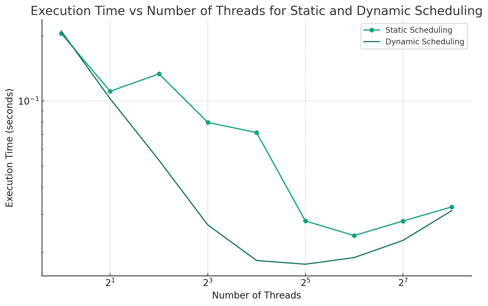

## 1. Introduction

This report delves into the parallel computation of the Mandelbrot set using OpenMP, with a focus on comparing static and dynamic scheduling. The Mandelbrot set, a complex fractal, presents a significant computational challenge, making it an ideal candidate for parallel processing. This study aims to assess the performance implications of different scheduling strategies in OpenMP, highlighting how they affect computation efficiency in a parallelized environment.

## 2. Methodology

The Mandelbrot set generation code from TP 5 was adapted for this experiment, using two separate implementations to facilitate static and dynamic scheduling. This bifurcation allowed each version to be specifically optimized through compilation, a crucial factor in parallel computing performance. Static scheduling was implemented by dividing the workload into predetermined chunks, while dynamic scheduling was applied to allocate workload in smaller, adaptable chunks based on thread availability.

## 3. Results and Analysis

### Execution Time Comparison

The experiment involved recording execution times for both static and dynamic scheduling across varying numbers of threads (1, 2, 4, 8, 16, 32, 64, 128, and 256). The results are visualized in the graph below:

Key observations from the graph include:
- Both scheduling strategies show decreased execution time with an increase in the number of threads, affirming the advantage of parallel processing.
- Dynamic scheduling consistently outperforms static scheduling, especially at higher thread counts, indicating superior load balancing and adaptability.
- The scaling of performance gains is non-linear, with both strategies showing diminishing returns or slight increases in execution times at higher thread counts.

### Performance Variations

Static scheduling exhibits an increase in execution time beyond 64 threads. In contrast, dynamic scheduling maintains relatively stable times after an initial drop, suggesting its efficiency in managing high thread numbers.

## 4. Challenges

One of the main challenges was optimizing load balancing to maximize performance. Static scheduling, although simpler, often led to uneven workload distribution. In contrast, dynamic scheduling provided better load balancing, adapting to runtime conditions but was more complex to implement. The separate compilations for each scheduling strategy highlight the importance of compilation in parallel computing, where optimization can significantly impact performance.

## 5. Running the Code

The code can be compiled using the provided `Makefile` by running `make` in the terminal. The executable can then be run using `./fractal_static` or `./fractal_dynamic` for static and dynamic scheduling, respectively. The number of threads can be specified using the `-t <num_threads>` flag.

## 6. Conclusion

This study highlights the importance of selecting an appropriate scheduling strategy in parallel computing. Dynamic scheduling, while more complex, offers superior performance and load balancing, especially at higher thread counts. This experiment contributes valuable insights into optimizing parallel computing tasks, demonstrating how different scheduling strategies can significantly influence performance in the context of OpenMP and the Mandelbrot set computation.
