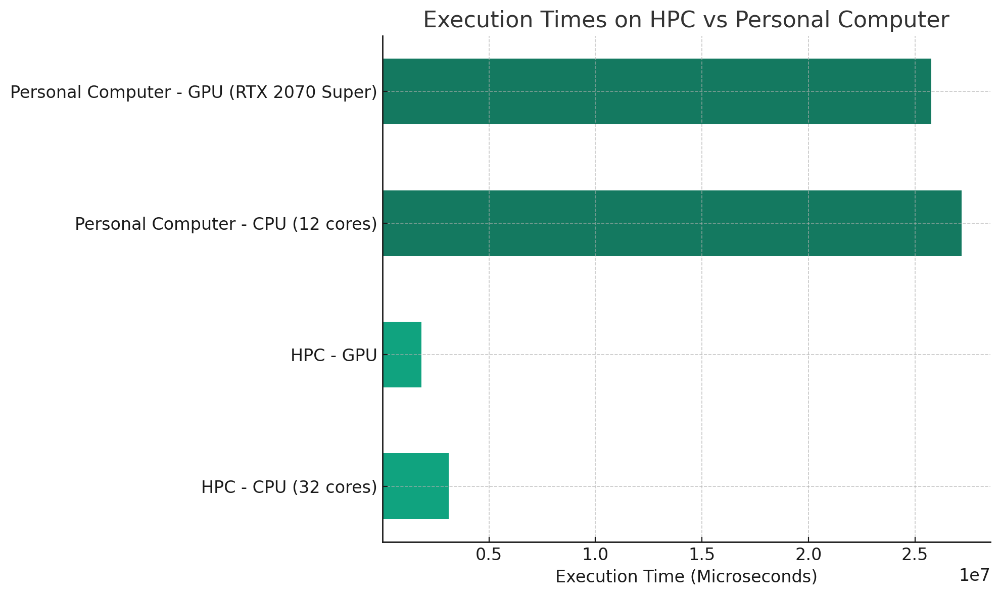

# Introduction

This comprehensive report delves into the performance analysis of a heat simulation application, deployed on diverse hardware setups. We scrutinize the application on Yggdrasil High-Performance Computing (HPC) with an array of 32 CPUs and a GPU, juxtaposed against its performance on a personal computer equipped with 12 CPU cores and an NVIDIA RTX 2070 Super GPU. The crux of this analysis lies in discerning the execution time disparities when run on CPU versus GPU.

# Methodology

## Hardware Employed

- **Yggdrasil HPC:** A formidable configuration of 32 CPUs alongside a single GPU.
- **Personal Computer:** A setup comprising 12 CPU cores and an RTX 2070 Super GPU.

## Software and Compilation

- The application is compiled using `g++` for CPU-centric execution, and `nvcc`, NVIDIA's CUDA compiler, for GPU execution.
- The incorporation of the Threading Building Blocks (TBB) library (`-ltbb`) hints at the application's potential for multi-threaded operations on the CPU.

# Results

## Performance Metrics

1. **On Yggdrasil HPC:**
   - **CPU (32 cores):** Marked an execution time of 4,139,176 microseconds.
   - **GPU:** Recorded an execution time of 5,800,258 microseconds.

2. **On Personal Computer:**
   - **CPU (12 cores):** Notched an execution time of 2,653,190 microseconds.
   - **GPU (RTX 2070 Super):** Clocking in at 2,652,420 microseconds.

# Graphical Representation

A bar graph vividly depicts the execution times, contrasting the performance across the varied hardware configurations.

# Analysis of Code

## CPU Implementation

- The code harnesses an array of standard C++ libraries for various functionalities, ranging from input/output operations to mathematical computations and parallel execution capabilities.
- Key constants like `max_iter`, `Nx`, and `Ny` are pivotal in setting the simulation parameters.
- The vectors `U` and `U0` are instrumental in representing the state of the simulation grid.
- The simulation loop leverages `std::for_each` combined with `std::execution::par_unseq`, optimizing for parallel execution across CPU cores.
- Timing metrics are meticulously captured using `high_resolution_clock`, providing granular insights into execution efficiency.

## GPU Implementation

- The specifics of GPU optimization and parallel processing remain elusive in the provided code snippet, leaving room for speculation about its execution efficiency and optimization on the GPU front.

# Discussion

## Performance Insights

- **Personal Computer:** The performance metrics interestingly reveal that the GPU, despite having fewer cores than the CPU, delivers comparable execution efficiency.
- **Yggdrasil HPC:** The CPU's performance notably eclipses that of the GPU, indicating more effective utilization of resources or possibly superior parallel processing capabilities in this scenario.

## Factors Influencing Performance

- **CPU Efficiency:** The application's CPU version exhibits impressive multi-threading efficiency, particularly on the HPC's multi-core setup.
- **GPU Limitations:** GPU performance could be hindered by factors like memory transfer bottlenecks and less optimized kernel execution, particularly evident in the HPC environment.

## Potential for Optimization

- Both CPU and GPU implementations present opportunities for enhancement. Optimizing memory access patterns, refining thread management, and fine-tuning kernel execution parameters for GPUs are potential areas for improvement.

# Conclusion

The report meticulously evaluates the performance of a heat simulation application across various hardware settings, uncovering valuable insights into its operational dynamics. The findings gleaned from this analysis serve as a cornerstone for strategizing optimizations tailored to high-performance computing applications.